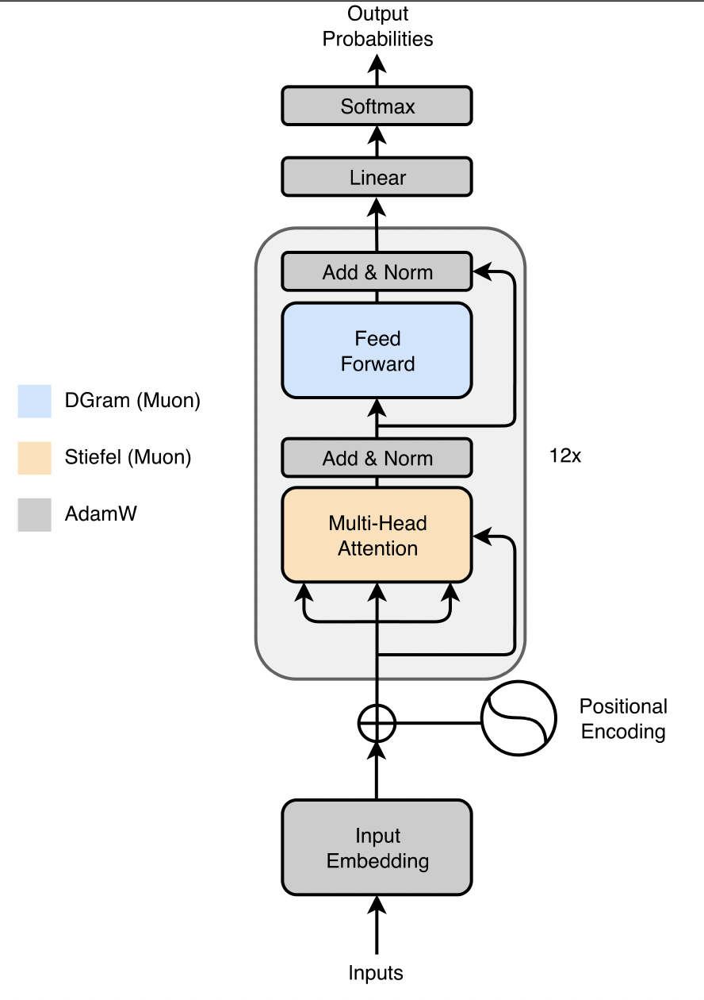
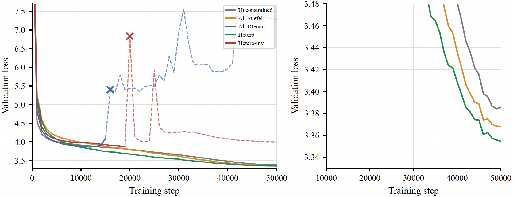

# Different Layers, Different Manifolds

[](https://arxiv.org/abs/2606.13276)
[](https://openreview.net/forum?id=0uL5u1Lywf)

**Module-Wise Weight-Space Geometry in Transformer Optimization**

> [!NOTE] 🎉 Accepted at the **ICML 2026 Workshop on Weight-Space Symmetries (WSS)**.

This repository contains the code for our study on assigning *different* manifold
geometries to different transformer modules when training GPT-2 with Manifold Muon.
The central finding is an asymmetry: constraining **attention** layers with **Stiefel**
geometry while assigning **DGram** geometry to **MLP** layers gives the best stable
configuration, whereas any configuration that places DGram on attention exhibits
training instability.


Built on [nanoGPT](https://github.com/karpathy/nanoGPT) and
[thinking-machines-lab/manifolds](https://github.com/thinking-machines-lab/manifolds).


## Method in brief

We optimize the 2D weight matrices of attention (`attn.c_attn`, `attn.c_proj`) and
MLP (`mlp.c_fc`, `mlp.c_proj`) projections with **Manifold Muon**, while all other
parameters (embeddings, LM head, LayerNorm scales) use AdamW. Each Muon-managed
matrix is constrained to one of two manifolds:

- **Stiefel** — enforces column orthonormality (`WᵀW = I`), bounding all singular
  values to 1 and giving strong spectral control.
- **DGram** — a weaker Gram-space constraint that only forces the off-diagonal Gram
  entries to vanish (`Off(WᵀW) = 0`). Column norms (and hence singular values) are
  left free, so the matrix gains scale degrees of freedom.

The question we study is which manifold each *module type* should use.

<p align="center">
  
</p>

*The `HETERO` assignment within each of the 12 transformer blocks: attention
projections are updated by Stiefel Manifold Muon (orange), feed-forward projections
by DGram Manifold Muon (blue), and all remaining parameters, including input embedding,
positional encoding, final linear layer, and normalization scales by AdamW (gray).*

## Results

The five configurations differ only in the `--manifold` assignment; architecture,
data, schedule, and all other hyperparameters are held fixed. Validation loss after
50k iterations of GPT-2 small pretraining on OpenWebText:

| Configuration | `--manifold` flag | Attention | MLP/FFN | Val. loss |
|---|---|---|---|---|
| Unconstrained | `none`        | None    | None    | 3.3855 |
| All-Stiefel   | `stiefel`     | Stiefel | Stiefel | 3.3679 |
| All-DGram     | `dgram`       | DGram   | DGram   | **Unstable** |
| **Hetero**    | `hetero`      | Stiefel | DGram   | **3.3544** |
| Hetero-Inv    | `hetero-inv`  | DGram   | Stiefel | **Unstable** |

`HETERO` (Stiefel attention + DGram MLP) is the best stable configuration. Every
configuration that places DGram on attention (`dgram`, `hetero-inv`) becomes unstable
during training, which we trace to explosive singular-value growth in the attention
weights that amplifies attention logits and saturates the softmax.



*Left: full training trajectories, including the unstable runs. Right: zoomed view of
the stable configurations late in training, where `HETERO` reaches the lowest loss.*

## Setup

Requires Python 3, PyTorch 2.0+ (for `torch.compile`), and a CUDA-capable GPU. The
experiments in the paper were run on a single H100 with CUDA 12.6.

```bash
pip install torch numpy transformers datasets tiktoken wandb tqdm
```

### Data

Prepare the OpenWebText dataset (produces `train.bin` / `val.bin` under `data/openwebtext/`):

```bash
python data/openwebtext/prepare.py
```

## Training

Each of the five configurations from the table is selected with a single flag. The
runs in the paper used the default hyperparameters in `train.py` (50k iterations,
batch size 64, block size 1024, bfloat16, `torch.compile`).

```bash
python train.py --manifold=none         # Unconstrained baseline
python train.py --manifold=stiefel      # All-Stiefel
python train.py --manifold=dgram        # All-DGram        (becomes unstable)
python train.py --manifold=hetero       # Hetero: Stiefel attn + DGram MLP  (best)
python train.py --manifold=hetero-inv   # Hetero-Inv: DGram attn + Stiefel MLP  (becomes unstable)
```

Each run writes to a timestamped directory under `out/` containing `config.json`,
per-step `metrics.jsonl`, `eval_metrics.jsonl`, per-eval spectral logs under
`spectral/`, and the `final_model.pt` checkpoint. The spectral logs (singular values
and Gram statistics per Muon matrix) are what produce the spectral-evolution figure
in the paper.

## Acknowledgements

This codebase is built on [nanoGPT](https://github.com/karpathy/nanoGPT). The
Manifold Muon formulation builds on
[thinking-machines-lab/manifolds](https://github.com/thinking-machines-lab/manifolds)
and follows the modular-manifold line of work; see the paper's references for details.

## License

MIT. This repository is derived from nanoGPT, which is also MIT-licensed; the original
copyright notice is retained in [`LICENSE`](./LICENSE).